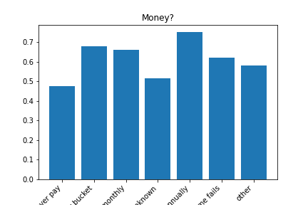

# Phase III Project ReadMe

Authors: Kyle Dufrane and Bradly Horn

## Overview

This project analyzes the Tanzanian Water Wells datasets released by the Tanzanian Government. The dataset includes 59,400 rows each repressenting a unique well within the Tanzanian Governments realm. Our targets are broken down into three categories:

* Functional
* Non Functional
* Functional Needs Repair

We will attempt to predict the status of the wells condition through utilizing Exploratory Data Analysis (EDA) and building classification models tuned to the parameters that will have the largest impact on our predictive ability. 

## Business Understanding

Flatiron LLC has recently been awarded a contract to maintain wells in Tanzania. They're looking for a system to help develop preventative maintenance schedules by predicting pump failures and replacement schedules to better serve their client. Flatiron LLC would like key insights on:

* Regional impact on wells
* Area's with low water quantity
* Negatively impacting factors on wells 

## Data Understanding

This dataset comes with two applicable files training_set_labels and training_set_values. During our EDA we will join these tables together to give us one file to work with. The values dataset has 39 total columns and contains all of our predicitve features. Below is a description of each column. 

* amount_tsh : Total static head (amount water available to waterpoint)
* date_recorded : The date the row was entered
* funder : Who funded the well
* gps_height : Altitude of the well
* installer : Organization that installed the well
* longitude : GPS coordinate
* latitude : GPS coordinate
* wpt_name : Name of the waterpoint if there is one
* num_private :Private use or not
* basin : Geographic water basin
* subvillage : Geographic location
* region : Geographic location
* region_code : Geographic location (coded)
* district_code : Geographic location (coded)
* lga : Geographic location
* ward : Geographic location
* population : Population around the well
* public_meeting : True/False
* recorded_by : Group entering this row of data
* scheme_management : Who operates the waterpoint
* scheme_name : Who operates the waterpoint
* permit : If the waterpoint is permitted
* construction_year : Year the waterpoint was constructed
* extraction_type : The kind of extraction the waterpoint uses
* extraction_type_group : The kind of extraction the waterpoint uses
* extraction_type_class : The kind of extraction the waterpoint uses
* management : How the waterpoint is managed
* management_group : How the waterpoint is managed
* payment : What the water costs
* payment_type : What the water costs
* water_quality : The quality of the water
* quality_group : The quality of the water
* quantity : The quantity of water
* quantity_group : The quantity of water
* source : The source of the water
* source_type : The source of the water
* source_class : The source of the water
* waterpoint_type : The kind of waterpoint
* waterpoint_type_group : The kind of waterpoint

### Import and Basic Interpretation on our Datasets

Reviewing the above output, we have a few columns with Null values. Going forward we will review these columns and identify the appropriate way to either replace or drop these columns. Also, we can see that we have an 'id' column which should allow us to join our tables.  

Out of the 39 features 7 of them are missing values. A few items stand out:

* Funder and installer have close to equal amounts of missing values
* subvillage has the least amount of missing values
* scheme_name is missing almost half of the values

Since scheme name is missing half of the data we will drop this column as it will not have a significant impact on our model. 

Lets take a deeper look into these 7 columns that are missing data. 

We can now see that all of these features are of the dtype object which narrows down our options to dealing with the missing values. What are these features composed of? 

To start, lets take a look at our previous mentioned insite of funders and installers having close to the same amount of missing values. 

Looking at the above counts we can compare when one value is null how it effects the other value within the dateframe. 

I.E. when 'funder' is null within the dataframe how many of the 'installers' are also labels as null. Above we can see that 3582 are 'installers' are labeled as null while 53 contain and actual value. 

With this information we will move forward working with these columns independently of one another.

### Funder:

The 'recorded_by' column contains 'GeoData Consultants Ltd' in each row. Lets take a deeper look at this and see if we are able to drop this row due to a single value. 

### Recorded_by:

With only one value for this column it will not have any effect on our model and are able to drop this column.

### Installer

Again, reviewing the above dataframe, nothing jumps out of importance. We will continue on and conclude our null value adjustments at a later time.

### Subvillage

One observation I found was that the 'region' contains 'Dodoma' multiple times. Lets look at the value counts for this. With Dodoma being the majority value here we will keep this in mind when replacing the values later on. 

### Public Meeting:

Again, reviewing the above dataframe, nothing jumps out of importance. We will continue on and conclude our null value adjustments at a later time.

## Data Preparation

For each column we will create two variables for modeling. One with the mode value for each column and one with a newly created variable denoted 'other'.

### Joining Tables

Now lets merge the tables so we only have two data sets to work with. To start, both dataframes have an ID column so we will create a new column on our target set and drop the identical column.

Next we will join our tables and create two dataframes for mode and other

As seen above our total rows equal that of the normal dataframe so we can conclude that our merges have been successful and we can drop our id_2 column.

### Additional Columns to Drop

The Id columns and date_recorded are considered admin columns and will not have much predictive power in our model therefore we can drop these columns. 

### First Simple Model

To start our modeling process we will use only our integers and floats.

The cross val scores are pretty consitent across the folds. This doesnt give us much insight as far as our NAN replacements in during the EDA. 

### Model Exploration

Now that we have our baseline established we will loop through other models to see if we can get better results between our two dataframes.

### 'Mode DF Loop

### 'Other' DF Loop

### Vanilla Models

### 'Mode' Results

### 'Other' Results

Based on the scores above, our scores are the best using RandomForestClassifier. This will be the model we use moving forward. There isn't any difference between our two dataframes so either one will work. We will move forward using the 'Mode' dataframe. 

For readability we will get all of our baseline metrics in one place.

### Our Recall, Precision, and F1 score all look good but our true test is the cross validation score. We can see a significant drop in our predicting capabilities. Hopefully we wil lbe able to improve on this going forward.

### Also, since our stakeholder is concerned with pump failures we need to avoid False Negatives. I.E. we do not want to say the well is broken when it in fact it is operational. Therefore we need to focus on our recall score and tune our model appropriately which is why we've used the recall_macro score so far. 

### Our models above only utilized our numerical values. We will now begin using our categorical features and identify feature importance. 

Adding features to see if our model improves all other steps are a repeat from above

Adding features to see if our model improves all other steps are a repeat from above

### Interesting results between our first three models with categorical features. Since we're looking for recall, model 1 and model 2 are our best performers with model 3 showing the lowest recall. Also, we can see that the cross validation score dropped by 10%. This model is definitely going in the trash. 

### Since we're one hot encoding all of these features we will start with model 1 and provide the model with less features. 

### Categorical & Numerical Data

### Finally we will build a pipeline to incorporate our numberical data.

## Testing Scores

