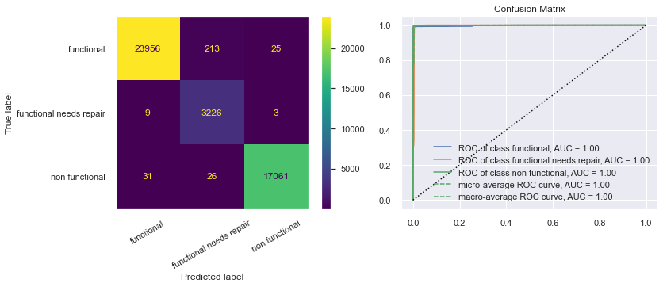
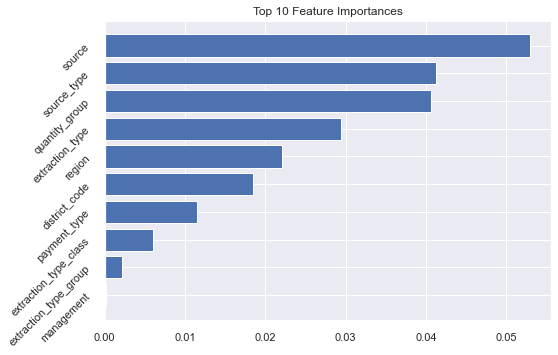
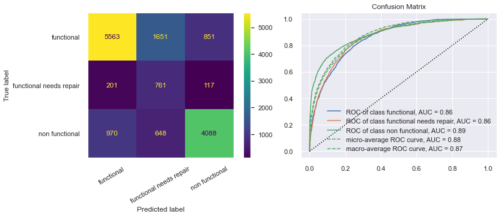
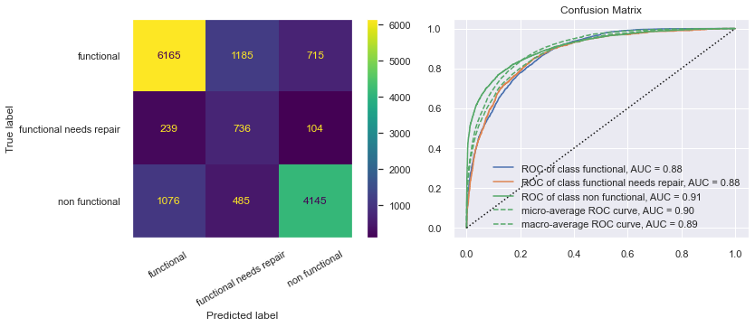

# Phase III Project Technical Notebook

#### Authors: Kyle Dufrane and Brad Horn

## Overview

This project analyzes the Tanzanian Water Wells datasets released by the Tanzanian Government. The dataset includes 59,400 rows each repressenting a unique well within the Tanzanian Governments realm. Our targets are broken down into three categories:

    * Functional
    * Non Functional
    * Functional Needs Repair

We will attempt to predict the status of the wells condition through utilizing Exploratory Data Analysis (EDA) and building classification models tuned to the parameters that will have the largest impact on our predictive ability.

## Business Understanding

Flatiron LLC has recently been awarded a contract to maintain wells in Tanzania. They're looking for a system to help develop preventative maintenance schedules by predicting pump failures and replacement schedules to better serve their client. Flatiron LLC would like key insights on:

    * Regional impact on wells
    * Area's with low water quantity
    * Negatively impacting factors on wells

## Data Understanding

This dataset comes with two applicable files training_set_labels and training_set_values. During our EDA we will join these tables together to give us one file to work with. The values dataset has 39 total columns and contains all of our predicitve features. Below is a description of each column.

    * amount_tsh : Total static head (amount water available to waterpoint)
    * date_recorded : The date the row was entered
    * funder : Who funded the well
    * gps_height : Altitude of the well
    * installer : Organization that installed the well
    * longitude : GPS coordinate
    * latitude : GPS coordinate
    * wpt_name : Name of the waterpoint if there is one
    * num_private :Private use or not
    * basin : Geographic water basin
    * subvillage : Geographic location
    * region : Geographic location
    * region_code : Geographic location (coded)
    * district_code : Geographic location (coded)
    * lga : Geographic location
    * ward : Geographic location
    * population : Population around the well
    * public_meeting : True/False
    * recorded_by : Group entering this row of data
    * scheme_management : Who operates the waterpoint
    * scheme_name : Who operates the waterpoint
    * permit : If the waterpoint is permitted
    * construction_year : Year the waterpoint was constructed
    * extraction_type : The kind of extraction the waterpoint uses
    * extraction_type_group : The kind of extraction the waterpoint uses
    * extraction_type_class : The kind of extraction the waterpoint uses
    * management : How the waterpoint is managed
    * management_group : How the waterpoint is managed
    * payment : What the water costs
    * payment_type : What the water costs
    * water_quality : The quality of the water
    * quality_group : The quality of the water
    * quantity : The quantity of water
    * quantity_group : The quantity of water
    * source : The source of the water
    * source_type : The source of the water
    * source_class : The source of the water
    * waterpoint_type : The kind of waterpoint
    * waterpoint_type_group : The kind of waterpoint

### Import and basic interpretation on our datasets

#### df_training_labels Info

RangeIndex: 59400 entries, 0 to 59399
Data columns (total 2 columns):

#Column        Non-Null Count  Dtype 
---  ------        --------------  ----- 
 0   id            59400 non-null  int64 
 1   status_group  59400 non-null  object
dtypes: int64(1), object(1)
memory usage: 928.2+ KB

#### df_training_labels Value Counts

functional                 32259
non functional             22824
functional needs repair     4317
Name: status_group, dtype: int64

Revewing the above information we do not have any nulls in our this dataset which is a good start as these are our targets. We can see that this dataset has two columns, one of which being 'id'. Hopefully we can use this to join our tables later in the EDA process.

The big catch here is seeing the class imbalance, we will have to adjust our model accordingly to make up for the lack of values especially within the 'functional needs repair' category.

Now we'll review our predictors within the Training_set_values.cvs

#### df_training_values Info
<class 'pandas.core.frame.DataFrame'>
RangeIndex: 59400 entries, 0 to 59399
Data columns (total 40 columns):
id   Column                 Non-Null Count  Dtype  
---  ------                 --------------  -----  
 0   id                     59400 non-null  int64  
 1   amount_tsh             59400 non-null  float64
 2   date_recorded          59400 non-null  object 
 3   funder                 55765 non-null  object 
 4   gps_height             59400 non-null  int64  
 5   installer              55745 non-null  object 
 6   longitude              59400 non-null  float64
 7   latitude               59400 non-null  float64
 8   wpt_name               59400 non-null  object 
 9   num_private            59400 non-null  int64  
 10  basin                  59400 non-null  object 
 11  subvillage             59029 non-null  object 
 12  region                 59400 non-null  object 
 13  region_code            59400 non-null  int64  
 14  district_code          59400 non-null  int64  
 15  lga                    59400 non-null  object 
 16  ward                   59400 non-null  object 
 17  population             59400 non-null  int64  
 18  public_meeting         56066 non-null  object 
 19  recorded_by            59400 non-null  object 
 20  scheme_management      55523 non-null  object 
 21  scheme_name            31234 non-null  object 
 22  permit                 56344 non-null  object 
 23  construction_year      59400 non-null  int64  
 24  extraction_type        59400 non-null  object 
 25  extraction_type_group  59400 non-null  object 
 26  extraction_type_class  59400 non-null  object 
 27  management             59400 non-null  object 
 28  management_group       59400 non-null  object 
 29  payment                59400 non-null  object 
 30  payment_type           59400 non-null  object 
 31  water_quality          59400 non-null  object 
 32  quality_group          59400 non-null  object 
 33  quantity               59400 non-null  object 
 34  quantity_group         59400 non-null  object 
 35  source                 59400 non-null  object 
 36  source_type            59400 non-null  object 
 37  source_class           59400 non-null  object 
 38  waterpoint_type        59400 non-null  object 
 39  waterpoint_type_group  59400 non-null  object 
dtypes: float64(3), int64(7), object(30)
memory usage: 18.1+ MB

Reviewing the above output, we have a few columns with Null values. Going forward we will review these columns and identify the appropriate way to either replace or drop these columns. Also, we can see that we have an 'id' column which should allow us to join our tables.

Below we will get a clearer understanding of what columns are missing columns.

id                           0
amount_tsh                   0
date_recorded                0
funder                    3635
gps_height                   0
installer                 3655
longitude                    0
latitude                     0
wpt_name                     0
num_private                  0
basin                        0
subvillage                 371
region                       0
region_code                  0
district_code                0
lga                          0
ward                         0
population                   0
public_meeting            3334
recorded_by                  0
scheme_management         3877
scheme_name              28166
permit                    3056
construction_year            0
extraction_type              0
extraction_type_group        0
extraction_type_class        0
management                   0
management_group             0
payment                      0
payment_type                 0
water_quality                0
quality_group                0
quantity                     0
quantity_group               0
source                       0
source_type                  0
source_class                 0
waterpoint_type              0
waterpoint_type_group        0
dtype: int64

Out of the 39 features 7 of them are missing values. A few items stand out:

    * Funder and installer have close to equal amounts of missing values
    * subvillage has the least amount of missing values
    * scheme_name is missing almost half of the values

Since scheme name is missing half of the data we will drop this column as it will not have a significant impact on our model.

As seen above, 7 columns are missing data. Lets take a deeper look into these columns.

#### df_training_values Info()

RangeIndex: 59400 entries, 0 to 59399
Data columns (total 6 columns):
id   Column             Non-Null Count  Dtype 
---  ------             --------------  ----- 
 0   funder             55765 non-null  object
 1   installer          55745 non-null  object
 2   subvillage         59029 non-null  object
 3   public_meeting     56066 non-null  object
 4   scheme_management  55523 non-null  object
 5   permit             56344 non-null  object
dtypes: object(6)
memory usage: 2.7+ MB

#### df_training_values Missing Values

funder               3635
installer            3655
subvillage            371
public_meeting       3334
scheme_management    3877
permit               3056
dtype: int64

We can now see that all of these features are of the dtype object which narrows down our options to dealing with the missing values. What are these features composed of?

To start, lets take a look at our previous mentioned insite of funders and installers having close to the same amount of missing values.

#### Installer Missing Values

True     3582
False      53
Name: installer, dtype: int64

#### Funder Missing Values

True     3582
False      73
Name: funder, dtype: int64

Looking at the above counts we can compare when one value is null how it effects the other value within the dateframe.

I.E. when 'funder' is null within the dataframe how many of the 'installers' are also labels as null. Above we can see that 3582 are 'installers' are labeled as null while 53 contain and actual value.

With this information we will move forward working with these columns independently of one another.

### Funder:

#### Value Counts

Government Of Tanzania    9084
Danida                    3114
Hesawa                    2202
Rwssp                     1374
World Bank                1349
                          ... 
Seleman Rashid               1
Jacobin                      1
Miab                         1
Jumanne                      1
Bakari Chimkube              1
Name: funder, Length: 1897, dtype: int64

#### Miss Value Check

The 'recorded_by' column contains 'GeoData Consultants Ltd' in each row. Lets take a deeper look at this and see if we are able to drop this row due to a single value.

### Recorded_by:

#### Value Counts

GeoData Consultants Ltd    59400
Name: recorded_by, dtype: int64

With only one value for this column it will not have any effect on our model and are able to drop this column.

### Installer:

#### Value Counts

DWE              17402
Government        1825
RWE               1206
Commu             1060
DANIDA            1050
                 ...  
CALTAZ KAHAMA        1
FRANKFURT            1
Mwita Lucas          1
MAISHULE             1
Buruba               1
Name: installer, Length: 2145, dtype: int64

Again, reviewing the above dataframe, nothing jumps out of importance. We will continue on and conclude our null value adjustments at a later time.

### Subvillage

#### Value Counts

Madukani        508
Shuleni         506
Majengo         502
Kati            373
Mtakuja         262
               ... 
Guluma            1
Ikoma             1
Namerock Juu      1
Kivera            1
Nyamakomelo       1
Name: subvillage, Length: 19287, dtype: int64

].png)

One observation I found was that the 'region' contains 'Dodoma' multiple times. Lets look at the value counts for this.

#### Value Counts

Dodoma    361
Mwanza     10
Name: region, dtype: int64

With Dodoma being the majority value here we will keep this in mind when replacing the values later on.

### Public Meeting:

#### Value Counts

True     51011
False     5055
Name: public_meeting, dtype: int64

#### Missing Value Check

Again, reviewing the above dataframe, nothing jumps out of importance. We will continue on and conclude our null value adjustments at a later time.

### Scheme Management

#### Value Counts

VWC                 36793
WUG                  5206
Water authority      3153
WUA                  2883
Water Board          2748
Parastatal           1680
Private operator     1063
Company              1061
Other                 766
SWC                    97
Trust                  72
None                    1
Name: scheme_management, dtype: int64

Again, reviewing the above dataframe, nothing jumps out of importance. We will continue on and conclude our null value adjustments at a later time.

### Permit:

#### Value Counts

True     38852
False    17492
Name: permit, dtype: int64

#### Missing Value Check

Interesting, it looks like we have a lot of null values in the installer and funder rows. Lets get a better understanding.

#### Missing Value Check Sum Scheme Management in Funder

46

#### Missing Value Check Sum Scheme Management in Installer

59

Misleading! Out of 3056 rows we have a total of 105 missing values between the two columns. I thought we were onto something but turns out this isn't an important find!

## Data Preparation

For each column we will create two variables for modeling. One with the mode value for each column and one with a newly created variable denoted 'other'.

Great! We have review the null values from both of our dataframes. Later on we will see if either value replacement has a better effect than the other.

### Joining Tables

Now lets merge the tables so we only have two data sets to work with. To start, both dataframes have an ID column so we will create a new column on our target set and drop the identical column.

Next we will join our tables and create two dataframes for 'mode' and 'other'

Let's verify that all id's are the same across the dataset

As seen above our total rows equal that of the normal dataframe so we can conclude that our merges have been successful and we can drop our id_2 column.

### Additional Columns to Drop

The Id columns and date_recorded can be considered admin columns and will not have much predictive power in our model therefore we will drop these columns.

### Data Preparation

To start with our data preparation we will create a function that allows us to see what percentage of features within a column fall within a status group.

I.E. if 4141 wells in Iringa are functional out of 5294 than 78.22% of the wells in Iringa are functional as seen below.

Below we can start visualizing graphs based on our saved dictionary. Lets see if anything stands out to us.

Since our stakeholder is concerned with the regional impact we can start with looking at the top performers folllowed by the lowest performing regions.

.png)

We can see that Iringa is our top performer with Lindi being the poorest. What're they're value counts though? Does this really mean anything?

All of these wells have strong values counts. This will be useful information for our stakeholder. We will now repeat the same process with non functional wells.

2.png)

Again, all of these wells have strong values counts. This will be useful information for our stakeholder. We will now repeat the same process with non functional wells.

Our stakeholder is also intersted in water quantity and what causes poor well performance. Lets see if we can dig up any other information.

3.png)

4.png)

Unsurprisingly you need water to have a functional well. I dont think this will be much insite to our stakeholder but more of a talking point during our presentation.

## Modeling

### First Simple Model

To start our modeling process we will use only our integers and floats and identify if either of our data sets out performs the other. Based on our results, we will decide which model to move forward with.

mode recall: 0.9646151149443224
mode precision: 0.9910484321431677
mode f1 score: 0.9771278730975221

ohter recall: 0.9646151149443224
other precision: 0.9910484321431677
other f1 score: 0.9771278730975221

#### Cross Val Score Mode

0.53760719, 0.54411437, 0.54796272

#### Cross Val Score Other

0.53754439, 0.53903549, 0.54467289

First Simple Model Results: We can see that our model is overfit based on the cross validation scores. This is a good starting point. Hopefully with feature importance and tuning we will be able to increase our final outcome.

### Model Exploration

Now that we have our baseline established we will loop through other models to see if we can get better results between our two dataframes.

### Mode DF Loop Results

#### Mode 1

{LogisticRegression(max_iter=1000, n_jobs=-1, random_state=42): 0.5525476992143659,
 RandomForestClassifier(n_jobs=-1, random_state=42): 0.9858136924803591,
 DecisionTreeClassifier(): 0.9858810325476992,
 KNeighborsClassifier(n_jobs=-1): 0.7509090909090909,
 SVC(random_state=42): 0.553625140291807}

#### Mode 2

{LogisticRegression(max_iter=1000, n_jobs=-1, random_state=42): 0.3502036637494005,
 RandomForestClassifier(n_jobs=-1, random_state=42): 0.5739576115732625,
 DecisionTreeClassifier(): 0.5484982506633665,
 KNeighborsClassifier(n_jobs=-1): 0.5016188169951085,
 SVC(random_state=42): 0.33703983508896396}

### Other DF Loop

#### Other 1

{LogisticRegression(max_iter=1000, n_jobs=-1, random_state=42): 0.5525476992143659,
 RandomForestClassifier(n_jobs=-1, random_state=42): 0.9858136924803591,
 DecisionTreeClassifier(): 0.9858810325476992,
 KNeighborsClassifier(n_jobs=-1): 0.7509090909090909,
 SVC(random_state=42): 0.553625140291807}

#### Other 2

{LogisticRegression(max_iter=1000, n_jobs=-1, random_state=42): 0.3502036637494005,
 RandomForestClassifier(n_jobs=-1, random_state=42): 0.5739576115732625,
 DecisionTreeClassifier(): 0.5478406822720301,
 KNeighborsClassifier(n_jobs=-1): 0.5016188169951085,
 SVC(random_state=42): 0.33703983508896396}

### Vanilla Model Results

{0: LogisticRegression(max_iter=1000, n_jobs=-1, random_state=42),
 1: RandomForestClassifier(n_jobs=-1, random_state=42),
 2: DecisionTreeClassifier(),
 3: KNeighborsClassifier(n_jobs=-1),
 4: SVC(random_state=42)}

Based on the scores above, our scores are the best using RandomForestClassifier. This will be the model we use moving forward. There isn't any difference between our two dataframes so either one will work. We will move forward using the 'Mode' dataframe.

For readability we will get all of our baseline metrics in one place.

### All baseline metrics

RFC Mode Recall: 0.9645623920640647
RFC Mode Precision: 0.9910019270224613
RFC Mode F1 score: 0.97707800090283
Baseline Cross_Val_Score: 0.5838819  0.56660651 0.57760688 0.56971399 0.57197877

Our Recall, Precision, and F1 score all look good but our true test is the cross validation score. We can see a significant drop in our predicting capabilities though, on a positive note, we have already seen a 3% increase from our first simple model.

Also, since our stakeholder is concerned with pump failures we need to avoid False Negatives. I.E. we do not want to say the well is broken when it in fact it is operational. Therefore we need to focus on our recall score and tune our model appropriately which is why we've used the recall_macro score so far.

### Categorical Models

Our models above only utilized our numerical values. We will now begin using our categorical features and identify feature importance.

To start our categorical process we will start with random columns to see what impact they have on the model overall.

Recall Score: 0.7233825002181652
Precision Score: 0.6280038442087865
F1 Score: 0.6239806685042923
Cross Val Score: [0.64805173 0.64953445 0.63741417]
Mean Cross Val Score: 0.6450001191316178

.png)

Since we're looking at our Recall score we are concerned with the values in the bottom left hand corner showing 358 (middle left column) and 2792 (bottom left column). We will try to drop these values to lower these values as much as possible going forward.

Next we will add additional columns and see how are model performs.

Recall Score: 0.7785554166495784
Precision Score: 0.6803394160713818
F1 Score: 0.6858160728684385
Cross Val Score: 0.67913047 0.67408504 0.67626952
Mean Cross Val Score: 0.676495010133646

2.png)

Improvement! Our AUC scores all went up and all of our values in our confusion matrix rose or fell in the correct spots. You can see that the values that we are concerned with dropped in the far bottom left but rose in the left middle.

Finally we will add all of the categorical features and see how our model performs.

Recall Score: 0.8574625931393763
Precision Score: 0.7558249872146746
F1 Score: 0.779425214154133
Cross Val Score: 0.6761367  0.67967339 0.67518257
Mean Cross Val Score: 0.6769975537880647

5.png)

This model is performing really well on our test data but we maybe starting to overfit our model as seen in the cross val scores being the same as model # 2. Moving forward use model # 2.

### Categorical & Numerical Data

Finally we will build a pipeline to incorporate our numberical data and categorical data from model # 2.

Recall Score: 0.9943618993760062
Precision Score: 0.975886872764026
F1 Score: 0.9847501151376267
Cross Val Score: [0.65418761 0.6619801  0.65147399]
Mean Cross Val Score: 0.6558805685583337

Oofff overfit and our cross val scores dropped from model # 2. Lets what happens when we remove some numeric variables.

Recall Score: 0.9943756768966034
Precision Score: 0.9759063685465467
F1 Score: 0.98476679234574
Cross Val Score: [0.65049472 0.66269374 0.64803508]
Mean Cross Val Score: 0.6537411824844862

Looks like our model dropped again. Lets try to tune our first pipeline and model # 2 and see what our results are.

### Feature Selection

## Final Scores
### Model # 2

Recall Score: 0.7038307064046395
Precision Score: 0.6277811467871036
F1 Score: 0.6264131058423547
Cross Val Score: 0.65749388 / 0.66547731 / 0.65762611
Mean Cross Val Score: 0.6601991015082623

### Numerical and Categorical Model

Recall Score: 0.7243185079575575
Precision Score: 0.6550372866253692
F1 Score: 0.6641691425090365
Cross Val Score: [0.66978695 0.66832472 0.68045661]
Mean Cross Val Score: 0.6728560931016002

Our Numeric & Categorical Model is our WINNER!
