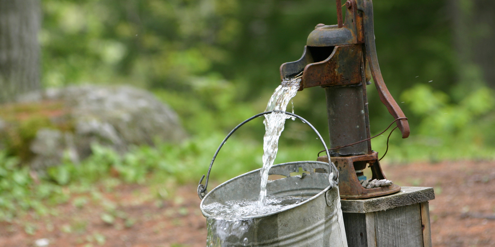
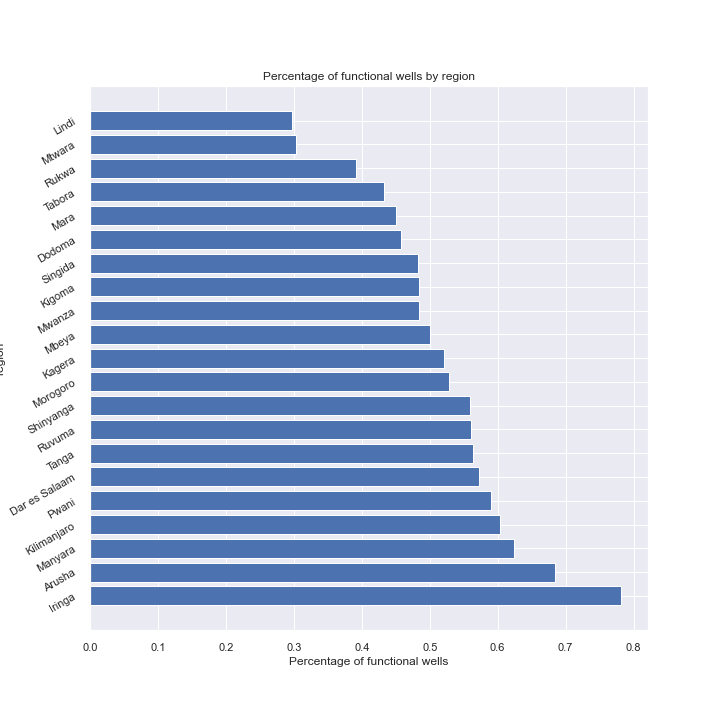
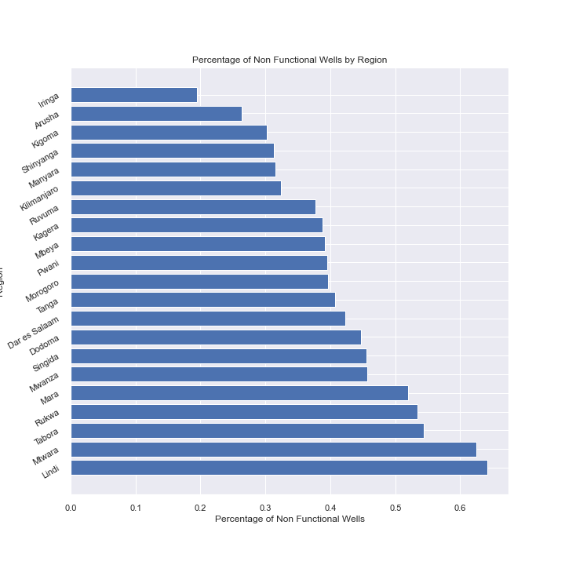

# Tanzanian Water Well's Status Predictions

#### Authors: Kyle Dufrane and Brad Horn

## Business Understanding

Flatiron LLC has recently been awarded a contract to maintain wells in Tanzania. They're looking for a system to help develop preventative maintenance schedules by predicting pump failures and replacement schedules to better serve their client. Flatiron LLC would like key insights on:

    * Regional impact on wells
    * Area's with low water quantity
    * Negatively impacting factors on wells

## Data Understanding

This project analyzes the Tanzanian Water Wells datasets released by the Tanzanian Government. The dataset includes 59,400 rows each repressenting a unique well within the Tanzanian Governments realm. Our targets are broken down into three categories:

    * Functional
    * Non Functional
    * Functional Needs Repair

We will attempt to predict the status of the wells condition through utilizing Exploratory Data Analysis (EDA) and building classification models tuned to the parameters that will have the largest impact on our predictive ability.

This dataset comes with two applicable files training_set_labels and training_set_values. During our EDA we will join these tables together to give us one file to work with. The values dataset has 39 total columns and contains all of our predicitve features. Below is a description of each column.

    * amount_tsh : Total static head (amount water available to waterpoint)
    * date_recorded : The date the row was entered
    * funder : Who funded the well
    * gps_height : Altitude of the well
    * installer : Organization that installed the well
    * longitude : GPS coordinate
    * latitude : GPS coordinate
    * wpt_name : Name of the waterpoint if there is one
    * num_private :Private use or not
    * basin : Geographic water basin
    * subvillage : Geographic location
    * region : Geographic location
    * region_code : Geographic location (coded)
    * district_code : Geographic location (coded)
    * lga : Geographic location
    * ward : Geographic location
    * population : Population around the well
    * public_meeting : True/False
    * recorded_by : Group entering this row of data
    * scheme_management : Who operates the waterpoint
    * scheme_name : Who operates the waterpoint
    * permit : If the waterpoint is permitted
    * construction_year : Year the waterpoint was constructed
    * extraction_type : The kind of extraction the waterpoint uses
    * extraction_type_group : The kind of extraction the waterpoint uses
    * extraction_type_class : The kind of extraction the waterpoint uses
    * management : How the waterpoint is managed
    * management_group : How the waterpoint is managed
    * payment : What the water costs
    * payment_type : What the water costs
    * water_quality : The quality of the water
    * quality_group : The quality of the water
    * quantity : The quantity of water
    * quantity_group : The quantity of water
    * source : The source of the water
    * source_type : The source of the water
    * source_class : The source of the water
    * waterpoint_type : The kind of waterpoint
    * waterpoint_type_group : The kind of waterpoint

## Data Preparatoin

Through our EDA process we identified 7 features that contained missing values. With feature 'scheme name' missing over half of its values we decided to remove this feature from our dataframe. The remaining columns had their values replaced via two means:

* mode
* 'other'

We decided to move forward with two modeling approaches to see if either has a larger effect than the alternative. Further analysis on this will be reviewed in the modeling section.

### Data Insights

Since our stakeholder is focused on servicing the water well's we began looking into functional & non-functional wells by region so they have a better understanding of where they will be allocating their resources. We created a feature which represents the percentage of funcional or non-functional and plotted these values, seen below.

